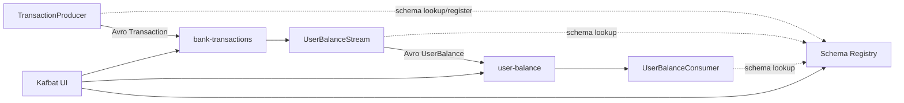

# Kafka Streams Bank Balance

Kafka Streams example that produces Avro `Transaction` events, aggregates them into per-user `UserBalance` records, and reads the results back from Kafka using Schema Registry.

## What this project does

This repo contains three small applications:

- `TransactionProducer`: produces random bank transactions to `bank-transactions`
- `UserBalanceStream`: aggregates transactions by user and writes running balances to `user-balance`
- `UserBalanceConsumer`: consumes the aggregated balances and prints them

Both input and output payloads use Avro schemas registered in Schema Registry.

## Architecture



## Data model

### Input schema: `Transaction`

File: [src/main/avro/Transaction.avsc](src/main/avro/Transaction.avsc)

Fields:

- `name`: user name
- `amount`: Avro decimal with `precision=12`, `scale=2`
- `time`: Avro `timestamp-millis`

### Output schema: `UserBalance`

File: [src/main/avro/UserBalance.avsc](src/main/avro/UserBalance.avsc)

Fields:

- `name`: user name
- `amount`: running total balance for that user
- `time`: latest transaction timestamp seen for that user

## Processing logic

`UserBalanceStream` groups transactions by Kafka record key. The producer uses the user name as the key, so all transactions for the same user are aggregated together.

Aggregation logic:

1. decode current `UserBalance.amount`
2. decode incoming `Transaction.amount`
3. add the two values
4. compare timestamps
5. keep the later timestamp
6. emit a new `UserBalance`

Semantically:

```text
balance[name].amount = balance[name].amount + transaction.amount
balance[name].time   = max(balance[name].time, transaction.time)
```

## Important code paths

### `TransactionProducer`

File: [src/main/java/com/github/yukiumetsu/udemy/kafka/streams/TransactionProducer.java](src/main/java/com/github/yukiumetsu/udemy/kafka/streams/TransactionProducer.java)

Important parts:

- creates `bank-transactions` and `user-balance` if missing
- uses `KafkaAvroSerializer`
- writes specific Avro `Transaction` records
- generates random names from a fixed list
- generates random decimal amounts and uses current `Instant`

### `UserBalanceStream`

File: [src/main/java/com/github/yukiumetsu/udemy/kafka/streams/UserBalanceStream.java](src/main/java/com/github/yukiumetsu/udemy/kafka/streams/UserBalanceStream.java)

Important parts:

- configures `SpecificAvroSerde<Transaction>` and `SpecificAvroSerde<UserBalance>`
- reads `bank-transactions`
- builds a `KTable<String, UserBalance>`
- writes results to `user-balance`
- enables `exactly_once_v2`
- uses a shutdown hook and `CountDownLatch` for controlled lifecycle

### `UserBalanceConsumer`

File: [src/main/java/com/github/yukiumetsu/udemy/kafka/streams/UserBalanceConsumer.java](src/main/java/com/github/yukiumetsu/udemy/kafka/streams/UserBalanceConsumer.java)

Important parts:

- uses `KafkaAvroDeserializer`
- enables `specific.avro.reader=true`
- reads `UserBalance` as a generated Avro class
- converts Avro decimal bytes back to `BigDecimal`

## Dev environment setup

### Prerequisites

- Java 11+
- Maven 3.9+
- Docker and Docker Compose

### Start infrastructure

This project includes [docker-compose.yml](docker-compose.yml) for:

- Kafka broker in KRaft mode
- Schema Registry
- Kafbat UI

Start the stack:

```bash
docker compose up -d
```

Useful endpoints:

- Kafka broker: `localhost:9092`
- Schema Registry: `http://localhost:8081`
- Kafbat UI: `http://localhost:8080`

### Generate Avro classes

The schemas under `src/main/avro` generate Java classes into `target/generated-sources/avro`.

```bash
mvn clean generate-sources
```

### Compile the project

```bash
mvn compile
```

If IntelliJ does not recognize generated classes:

1. reload the Maven project
2. mark `target/generated-sources/avro` as generated sources if needed

## How to run the demo

This project is easiest to run from IntelliJ by launching the classes directly.

Run these in order:

1. `TransactionProducer`
2. `UserBalanceStream`
3. `UserBalanceConsumer`

Main classes:

- `com.github.yukiumetsu.udemy.kafka.streams.TransactionProducer`
- `com.github.yukiumetsu.udemy.kafka.streams.UserBalanceStream`
- `com.github.yukiumetsu.udemy.kafka.streams.UserBalanceConsumer`

You can also inspect topics and schemas in Kafbat UI at `http://localhost:8080`.

## Example event flow

### Example input records on `bank-transactions`

Avro on Kafka is binary, but logically the input data looks like this:

```json
[
  {
    "key": "alice",
    "value": {
      "name": "alice",
      "amount": 125.75,
      "time": "2026-05-18T15:00:00Z"
    }
  },
  {
    "key": "alice",
    "value": {
      "name": "alice",
      "amount": 20.25,
      "time": "2026-05-18T15:01:10Z"
    }
  },
  {
    "key": "bob",
    "value": {
      "name": "bob",
      "amount": 50.00,
      "time": "2026-05-18T15:02:00Z"
    }
  }
]
```

### Example aggregated output on `user-balance`

```json
[
  {
    "key": "alice",
    "value": {
      "name": "alice",
      "amount": 146.00,
      "time": "2026-05-18T15:01:10Z"
    }
  },
  {
    "key": "bob",
    "value": {
      "name": "bob",
      "amount": 50.00,
      "time": "2026-05-18T15:02:00Z"
    }
  }
]
```

## Technical details

### Serialization

- Producer value serializer: `KafkaAvroSerializer`
- Streams value serde: `SpecificAvroSerde`
- Consumer value deserializer: `KafkaAvroDeserializer`

### Decimal handling

Avro decimal logical types are stored as `bytes`, not as Java `BigDecimal` directly. This code converts:

- `BigDecimal -> ByteBuffer` when producing or emitting aggregate results
- `ByteBuffer -> BigDecimal` when aggregating or consuming

### Exactly-once processing

`UserBalanceStream` sets:

```java
StreamsConfig.PROCESSING_GUARANTEE_CONFIG = exactly_once_v2
```

This enables Kafka Streams exactly-once processing semantics for the topology.

### Topic layout

- `bank-transactions`
  - key: `String`
  - value: `Transaction`
- `user-balance`
  - key: `String`
  - value: `UserBalance`

## Current implementation notes

- `TransactionProducer` currently emits roughly one event every `50ms`
- the Docker Compose stack pre-creates `bank-transactions`
- `TransactionProducer` also attempts to create topics on startup
- the Maven shade plugin main class in `pom.xml` is still stale and should be updated before relying on a packaged fat jar

## Repo layout

```text
.
├── docker-compose.yml
├── pom.xml
├── src
│   └── main
│       ├── avro
│       │   ├── Transaction.avsc
│       │   └── UserBalance.avsc
│       └── java
│           └── com/github/yukiumetsu/udemy/kafka/streams
│               ├── TransactionProducer.java
│               ├── UserBalanceConsumer.java
│               └── UserBalanceStream.java
```

## Troubleshooting

### Generated Avro class is not found

Run:

```bash
mvn clean generate-sources
```

Then reload the Maven project in IntelliJ.

### Schema Registry connection errors

Verify:

- Kafka is running on `localhost:9092`
- Schema Registry is running on `http://localhost:8081`
- `docker compose ps` shows healthy containers

### `SpecificAvroSerde` errors at runtime

Explicit serde instances must be configured with:

```java
Map.of("schema.registry.url", "http://localhost:8081")
```

This is already done in `UserBalanceStream`.
